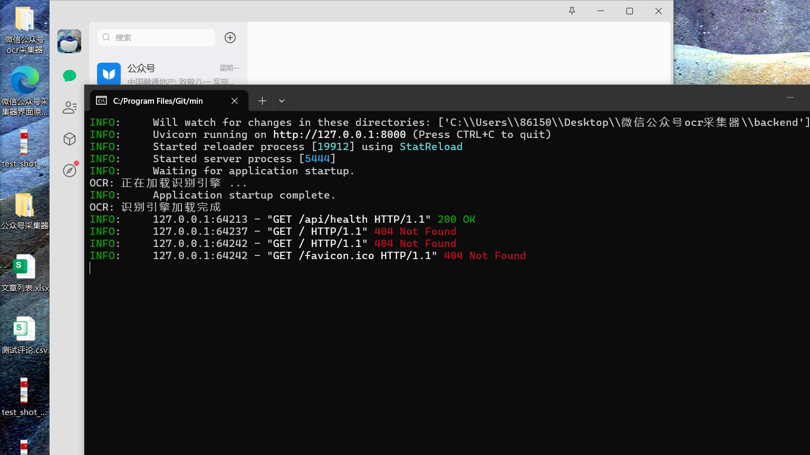

# 微信公众号 OCR 采集器

> 自动采集公众号文章、互动数据与评论区内容，免手动操作微信，数据一目了然。

---

## 一、它能做什么

打开程序就是一个公众号管理页面：



在这个页面上你可以：

- **管理公众号**：新增、链接识别、文件批量导入、拖拽排序、勾选批量操作
- **一键采集文章**：勾选公众号点「采集选中」，程序自动打开微信、搜一搜、进入公众号、识别并采集全部文章（支持按日期范围）
- **采集互动数据**：每篇文章的阅读 / 点赞 / 转发 / 喜欢，自动从页面识别
- **采集评论区**：文章评论、二级回复、点赞数、IP 属地，自动展开并整理
- **保存网页快照**：每篇文章的 HTML（含图片）自动存档到本地
- **导出表格**：公众号 / 文章 / 评论一键导出 Excel

文章、评论、导出、更新等更多功能在文章页与评论页，感兴趣点进去就能看到。

---

## 二、快速开始（免搭建，直接跑）

不用装任何环境 —— 直接运行打包好的程序：

1. 打开 **release** 目录（或收到的压缩包解压后的目录）
2. 双击 **WeChatCollector.exe**
3. 稍等 1~2 秒（程序会自动拉起后台服务），桌面窗口出现即可使用

> 💡 程序自带了一套**测试数据**：预置了公众号「深圳本地宝」和它 3 篇文章（其中一篇带评论区数据），打开后可直接在列表看到效果，点「查看全部文章」体验数据浏览；也可以从「新增 / 文件导入」开始录入你自己的公众号。

### 首次使用前必看：三个设置

程序界面底部有「**点位设置 · 滚动设置 · AI 模型**」三个按钮。刚拿到程序时它们会**显示红色感叹号**，鼠标移上去能看到缺什么：

| 按钮 | 要做什么 | 为什么 |
| --- | --- | --- |
| 点位设置 | 给每个点位补上屏幕坐标（x, y） | 程序靠这些坐标模拟点击微信界面 |
| 滚动设置 | 填写滚动距离（>0） | 滚动文章列表/评论区时用 |
| AI 模型 | 填写 API Key、选模型 | 识别互动数据与评论内容用 |

三个都配好后，红色消失，采集按钮才能使用。坐标一般和微信窗口位置相关，第一次按提示逐项填写即可。

---

## 三、整体流程（它是怎么工作的）

```
你 勾选公众号 → 点「采集选中」
        │
        ▼
程序 自动操作微信（模拟点击/搜索/滚动）
        │
        ▼
OCR识别屏幕(本地引擎) + AI视觉模型(豆包) 提取文字数据
        │
        ▼
写入数据库 + 存档文章HTML → 界面列表刷新
```

- **采集时**：程序会隐藏任务栏（弹窗打开即隐藏、关闭即恢复），全程可随时按 **ESC** 停止
- **采集过程**：底部日志实时显示每一步，出错会红字标出
- **数据存储**：账号/文章/评论存数据库 `data/collector.db`；文章快照存 `data/article_data/`（都在程序目录的 data 文件夹里，整个 data 文件夹拷走即完成"迁移"）

---

## 四、常见问题

- **采集按钮点不动（置灰）**：点位 / 滚动 / AI 没配置全，鼠标悬停感叹号看具体缺什么
- **采集到一半想停**：按键盘 ESC
- **文章里的"10万+"数字**：程序会自动换算成 100000
- **换了电脑**：把整个程序目录（尤其 data 文件夹）复制过去即可